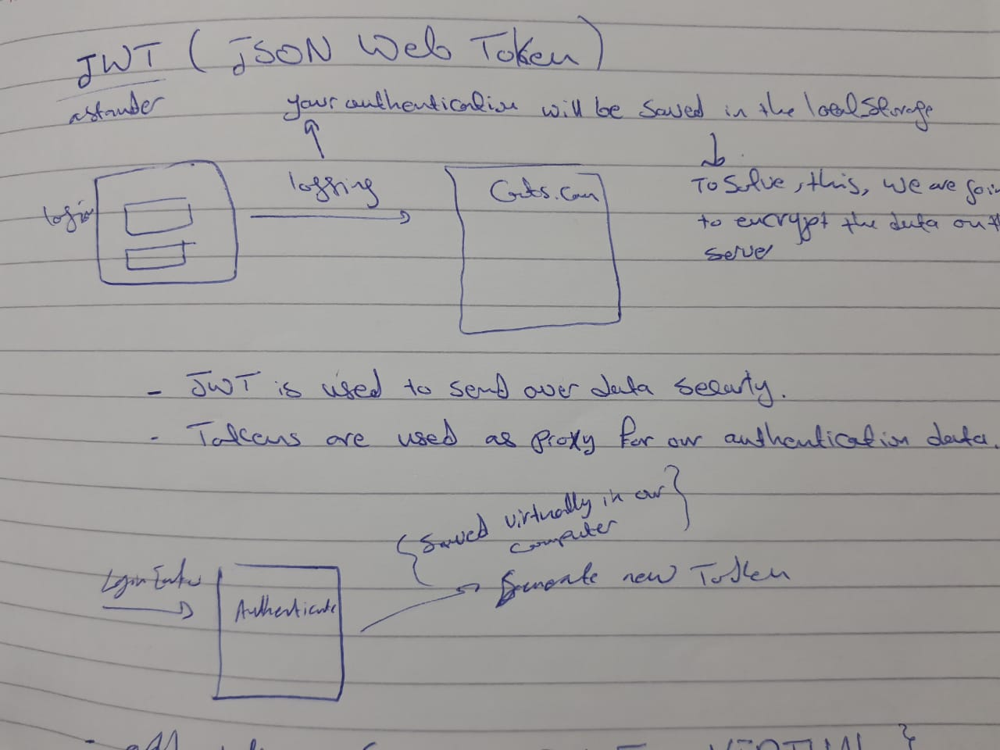

LAB07 - Authentication
Bayan Qutshan

* [Pull-Request](https://github.com/BianQt/bearer-auth/pull/1)
* [bianqt-bearer-auth](https://bianqt-bearer-auth.herokuapp.com/)

## Setup
```.env``` requirements
```PORT``` - Port Number
```DATABASE_URL```- Database URL

## Running the app
```npm start``` / ```npm run dev```

## Tests
Unit Tests: npm run test
Lint Tests: npm run lint

## UML
